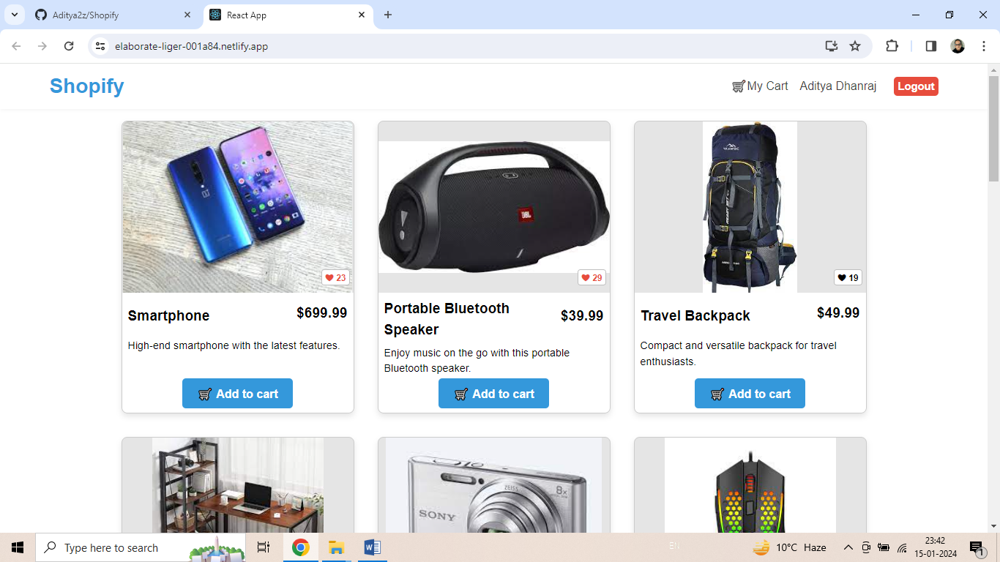
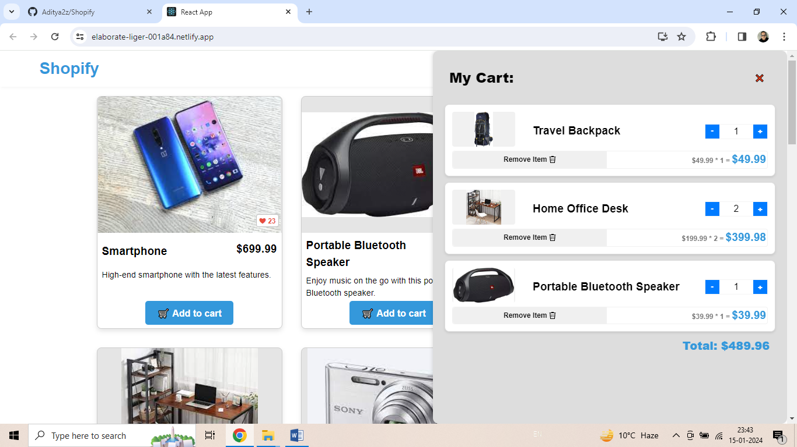

# Shopify App

Welcome to our Shopify App repository! This project is a simple web application designed as a Shopify app, providing basic functionalities such as user authentication (login and signup), product liking, and adding items to the shopping cart.


## Table of Contents

- [Features](#features)
- [Getting Started](#getting-started)
  - [Prerequisites](#prerequisites)
  - [Installation](#installation)
- [Usage](#usage)
- [Contributing](#contributing)
- [License](#license)

## Features

1. **User Authentication:**
   - Shopify users can sign up for a new account.
   - Existing users can log in to their accounts.

2. **Product Liking:**
   - Users can like their favorite products.
   - Liked products are saved for future reference.

3. **Shopping Cart:**
   - Users can add products to the shopping cart.
   - The shopping cart keeps track of selected items.




## Getting Started

### Prerequisites

Make sure you have the following installed:

- [Node.js](https://nodejs.org/)
- [npm](https://www.npmjs.com/)

### Installation

1. **Clone the repository:**

  ```bash
  git clone https://github.com/your-username/shopify-app.git
  cd shopify-app
  ```
2. **Create a .env file in the root of the project and add the following:**
  ```bash
  JWT_SECRET=your_shopify_api_secret
  Replace your_shopify_api_secret with the actual credentials.
  ```

3. **Install dependecies:**
  ```bash
  npm i
  ```

4. **Build the project using Webpack:**
  ```bash
  npm run build
  ```

5. **Start the application:**
  ```bash
  npm start
  ```

The application will be accessible at http://localhost:3000 by default.

### Usage
- Open your web browser and navigate to http://localhost:3000.
- Sign up for a new account or log in if you already have one.
- As a user, you can like your favorite products.
- Add products to the shopping cart.
- Review and proceed to checkout.
- Feel free to explore the codebase to understand how the different features are implemented.

### Contributing
Contributions are welcome! Please follow our contribution guidelines for details on the process.

### License
This project is licensed under the MIT License. Feel free to use, modify, and distribute the code as per the license terms.
